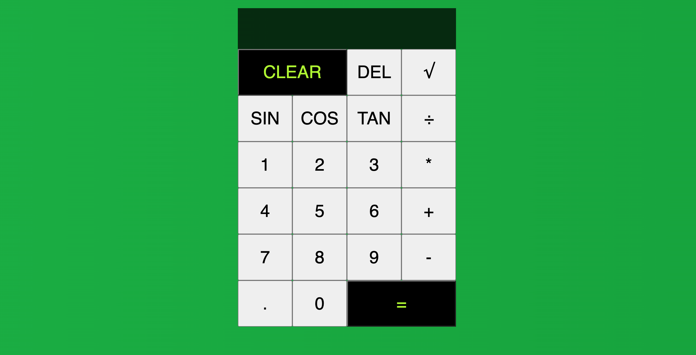

This was just a little side project to help me start learning Javascript a bit better- hosted with Falsk this calculater can perform some basic functions as well as a few trigonmetry functions. I plan to update it soon with more functions and other improvements.

